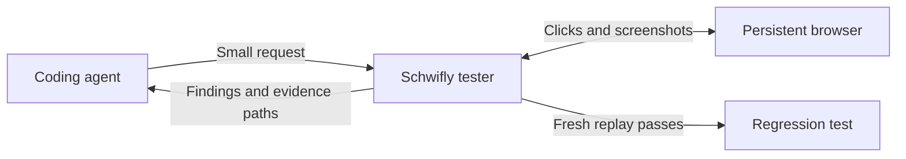

# Schwifly

## Keep coding. Let Schwifly check the browser.

Browser testing slows coding agents down. Every click, page snapshot, and console dump takes time and fills their context.
Schwifly keeps that work in a separate tester. Your coding agent sends a request and gets concise findings, focused screenshots, and relevant browser errors.

**Fix the app. Say "try the button again". Keep the browser context.**



- **Keep working during tests.** Runs return an ID immediately. Progress goes to a file.
- **Skip repeated browser setup.** A tester retains the browser and recent interaction context until you reset it.
- **See what changed.** Mark a baseline, edit the app, and compare the same interaction and element screenshots.
- **Keep useful checks.** Save captured actions as a regression test after they pass a fresh replay without model repair.

## A short demo

Start a tester against your running app. It opens a browser and returns a session ID.

```bash
pnpm exec schwifly session start --url http://localhost:3000
pnpm exec schwifly session ask <session-id> "Check whether Go is centered and readable. Check its press animation. Click Go. <expect>Confirm</expect>" --element '#go'
```

Each check returns a run ID and exact commands to read its status, result, or progress file.
Keep coding while Schwifly works. Read the result when you need it.

```bash
pnpm exec schwifly show <run-id>
pnpm exec schwifly session baseline <session-id>
```

Change the app, then repeat the captured interaction:

```bash
pnpm exec schwifly session ask <session-id> "Try the button again"
pnpm exec schwifly session compare <session-id>
pnpm exec schwifly session save <session-id> --name go-opens-confirm
```

Illustrative result, shortened:

```text
status: passed
verified[1]:
  the page shows Confirm
opinions: The button text looks readable.
browserErrors[0]:
screenshots[2]{label,path}:
  before,.schwifly/background/<run-id>/before.png
  after,.schwifly/background/<run-id>/after.png
```

Screenshots crop the selected element with 12 pixels of padding. Use `--padding` to change it.
If the element disappears after the interaction, the final image shows the page instead.
Without `--element`, the tester asks the model to identify the main element, or captures the page when none matches.
Press checks include a held-pointer screenshot and measured state changes. Visual opinions remain separate from verified visible-text checks.
Image comparisons report changed or unchanged pixels. They do not declare a design correct.

## Start small

Use Node 22.6 or newer. This checkout currently ships as an archive:

```bash
pnpm pack --pack-destination artifacts
```

In your app repository:

```bash
pnpm add -D /path/to/schwifly/artifacts/schwifly-0.1.0.tgz
pnpm exec schwifly install-browser
pnpm exec schwifly setup --models google/gemini-3.8-flash
```

Pipe your OpenRouter key from your secret manager into `pnpm exec schwifly setup --key-stdin`.
Schwifly stores it in the OS credential store. CI can supply `OPENROUTER_API_KEY` through its secret environment.
An ignored `.env` also works. Deterministic replay and page screenshots need no model key.

For a disposable check:

```bash
pnpm exec schwifly run "Click Go. <expect>Confirm</expect>" --url http://localhost:3000 --screenshots
pnpm exec schwifly status <run-id>
pnpm exec schwifly show <run-id>
```

`run`, `suite`, and `save` use the background by default. Add `--foreground` when a script needs the final exit code.
`status` and `show` exit 1 for failed background work. A queued run exits 0 because submission succeeded.
`--root` selects another workspace. Every receipt includes commands with the correct workspace and log path.

## Own the feedback loop

| You need to | Command |
| --- | --- |
| Find running testers | `schwifly session list` |
| Get the local browser debug endpoint | `schwifly session status <session-id>` |
| Wipe tester memory and start a clean browser | `schwifly session reset <session-id>` |
| Close the browser and retain evidence | `schwifly session stop <session-id>` |
| Find results | `schwifly runs` |
| Replay a saved check | `schwifly run workflows/go-opens-confirm.spec.ts` |
| Read complete evidence | `schwifly show <run-id> --full` |

Each tester processes checks in order. A baseline marks the last completed check.
Comparison runs the app's setup hook, then replays captured actions without model discovery.
Saving requires a passing visible-text check and fresh replay. Visual opinions and press measurements do not become regression assertions.
For richer product checks, author a story with deterministic proof functions. See [detailed usage](docs/usage.md#author-a-story).

<details>
<summary>Agent integration and output formats</summary>

Install live workspace context or on-demand instructions. Either works alone.

```bash
pnpm exec schwifly setup --agent all
pnpm exec schwifly setup --skill
```

`--agent` accepts `claude`, `codex`, `opencode`, or `all`. Setup preserves unrelated integration settings.
The [generated skill](skills/schwifly/SKILL.md) teaches the commands without loading browser details into the coding conversation.

Default output uses [TOON](https://toonformat.dev/reference/spec), a compact structured text format.
`--json` retains machine-readable detail. Progress uses stderr or the background log.
Exit codes are 0 for success, 1 for failed work, and 2 for invalid arguments. Every command accepts `--help`.

</details>

<details>
<summary>Login, app reset, and reliable regression tests</summary>

Configure saved login and the app's setup hook in `schwifly.config.ts`.
Discovery and fresh replay both act on the app. The setup hook makes repeated mutations predictable.
A persistent tester keeps browser state between requests. Reset replaces the browser and clears its memory and baseline.
Comparison reruns app setup in the existing browser before replaying the captured interaction.

Screenshots mask form fields, known secret text, and elements marked `data-private` or `data-schwifly-private`.
The browser debug endpoint stays local. Session evidence remains on disk after stop or reset.

See [login and setup](docs/usage.md), [CLI contracts](docs/agent-cli.md), and [tester lifecycle](docs/tester-sessions.md).

</details>

<details>
<summary>Settings for less powerful machines</summary>

Use `session start --headless` to hide the browser window. Stop unused testers with `session stop`.
A workspace permits 1 browser owner. Each tester processes 1 check at a time.
Saved-test certification opens a fresh browser while the tester remains idle.

Discovery allows at most 12 actions. Use `run --max-steps 4` for smaller checks.
Standalone browser sessions and tester checks have a 120-second limit. An idle tester remains open until stopped.
Child runners use 1 worker. Model requests have a 30-second limit.

</details>

<details>
<summary>Contribute or work on this repository</summary>

```bash
pnpm install --frozen-lockfile
pnpm exec playwright install chromium
pnpm run typecheck
pnpm run verify --workers=1
pnpm run verify:package
pnpm run skill:check
```

Normal verification needs no keys. The package check installs an archive in a separate consumer app.
Live provider checks require `SCHWIFLY_LIVE=1`. Read local agent context for host-specific limits.

Stagehand and Playwright versions are pinned because browser evidence callbacks are experimental.
`pnpm run bench` measures a Stagehand version against controlled scenarios and writes a report to
`docs/bench/`. It costs money and drives a browser, so run it alone. See [benchmarking](docs/benchmark.md).
See [the roadmap](TODO.md), [architecture and usage](docs/usage.md), and [delivery evidence](docs/testing-suite-progress.md).

</details>
